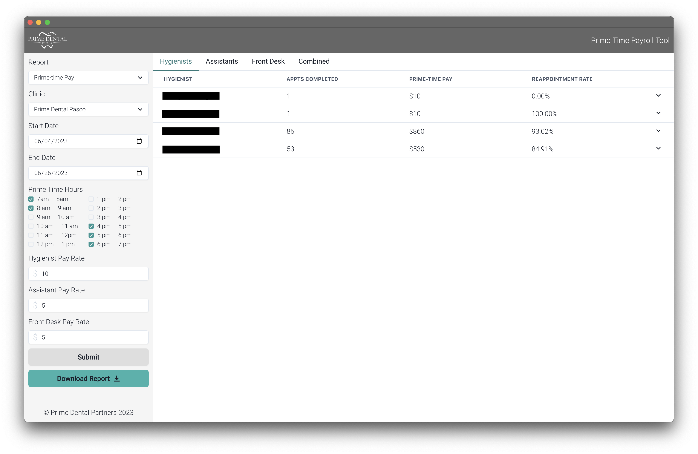
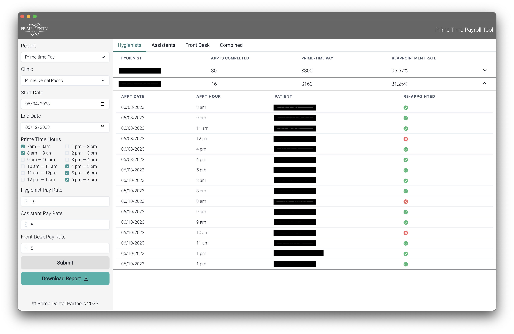
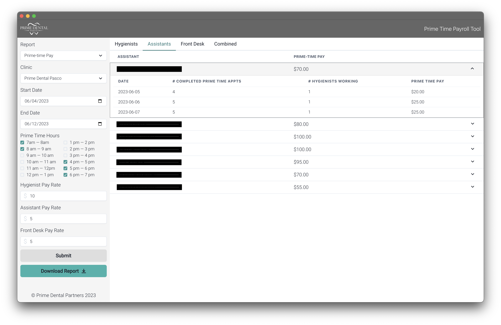
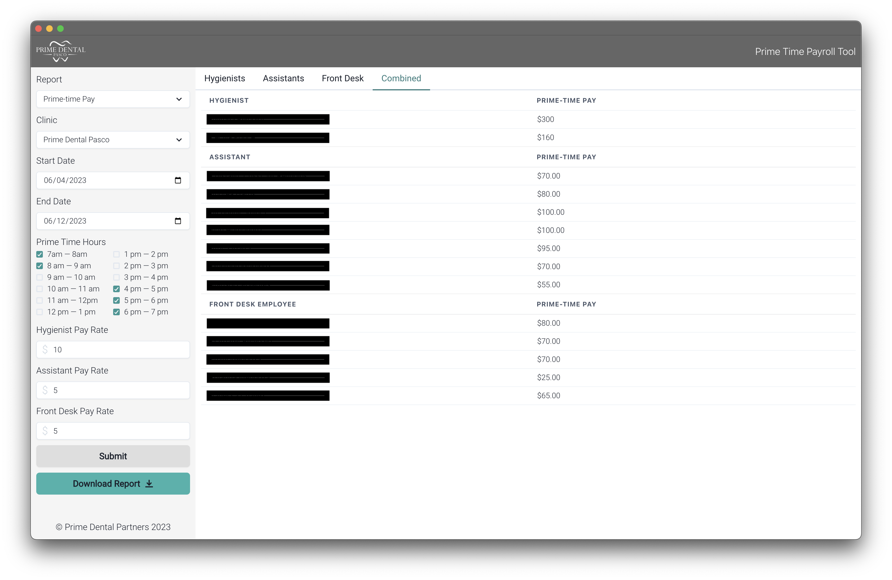
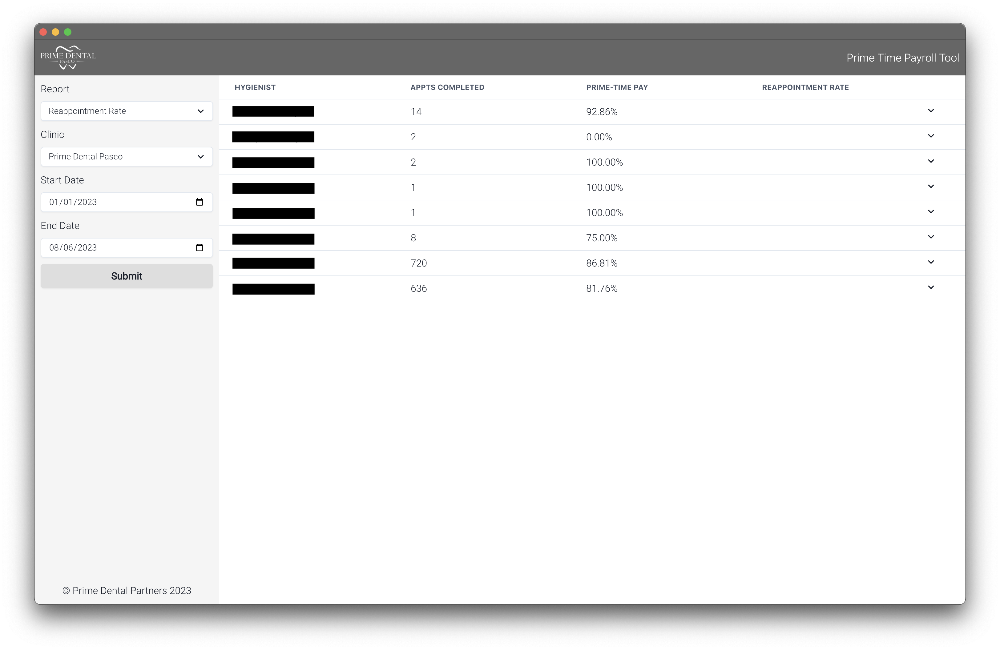

# Prime Time Payroll Tool
## Overview
I wrote this software for Prime Dental Partners to help with complex employee bonus pay calculations, namely, prime-time pay calculations.

## Background— What is prime-time pay?
To maximize dental office efficiency, certain hours of the day are designated as “prime-time” slots, where two patients can be scheduled simultaneously. 

To see both patients at the same time, the hygienist and assistant must each take back a patient at the same time and each must complete their duties solo. This results in added stress for both the hygienist and assistant.

To account for this added stress, bonus pay is given for every patient seen in a prime-time slot. 

## Why was this software needed?
To calculate prime-time pay for hygienists, the managers must count the number of appointments each hygienist completed for a given time period and then multiply that number by the bonus rate per appointment. This is a tedious and time-consuming process.

To calculate prime-time pay for assistants is even more complicated. The managers must count the number of appointments completed in prime-time slots for each day of the given period and determine which assistants were working that day. They then multiply the number of completed prime-time appointments by the assistant bonus rate divided by the number of hygienist working that day.

This whole process could take the managers hours to complete, which is why they were looking for a better way.

## How this software solves the problem
This software automates the entire bonus-pay calculation process. The office managers can enter a date range, prime-time hours, and pay rates. The program will then query the Open Dental API for any info needed to calculate bonus pay for hygienists, assistants, and front-desk team members. The office managers were very happy with the resulting product and we have been in talks on expanding the functionality of this software to help with other reporting needs.

## Tech Stack
* [TypeScript](https://www.typescriptlang.org/docs/)
* [Electron.js](https://www.electronjs.org/)
* [React.js](https://react.dev/)
* [ChakraUI](https://chakra-ui.com/)

## Other Helpful Resources
* [Open Dental API Documentation](https://www.opendental.com/site/apispecification.html)
* [Open Dental Database Documentation](https://www.opendental.com/OpenDentalDocumentation22-4.xml)

## Sreenshots

### Hygienist Report View

### Hygienist Report View Expanded

### Assistant Report View

### Combined Report View

### Re-appointment Rate Report View

